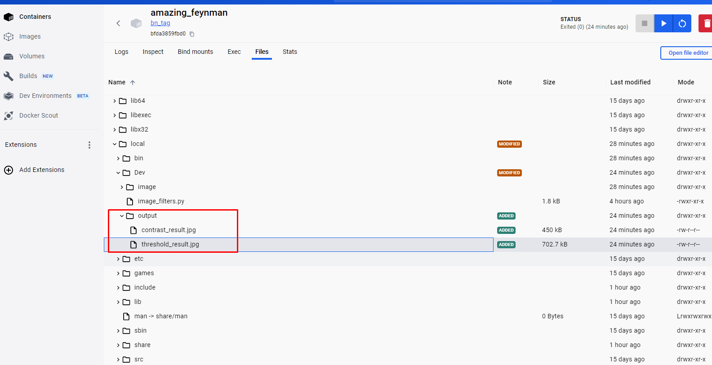

# Лабораторная работа №2. Docker

### Выполнил студент 6231-010402D Непряхин Богдан Олегович

## Задание 1
Создан [Dockerfile](https://github.com/bnepryakhin63/AIT/blob/master/Lab2/Dockerfile) с поддержкой CUDA запускаемый через build.sh, написан [код на py](./Lab2/image_filters.py) для работы с изображениями, запущен контейнер, и получены два обработанных изображения.
Итог задания:  
Обработанные [файлы](./Lab2/out/contrast_result.jpg) и [файл](./Lab2/out/threshold_result.jpg)

## Задание 2 Нейронные сети и Docker
Собран новый [Dockerfile](./Lab2/Ex2/Dockerfile) с pythorch и CUDA, написан код для обработки изображения (детектирование объектов на фото с использованием сети [глубокого обучения](./Lab2/Ex2/image_processing_script.py) ), в консоли выведено итоговое изображение и на самом изображении добавлена разметка. 
Итог задания:  и 
